<h1><b> How to Setup Arduino IDE</b></h1>

<h1> Download and install Arduino IDE </h1>

**1 -** Download the Arduino IDE from **[here](https://www.arduino.cc/en/software)**:

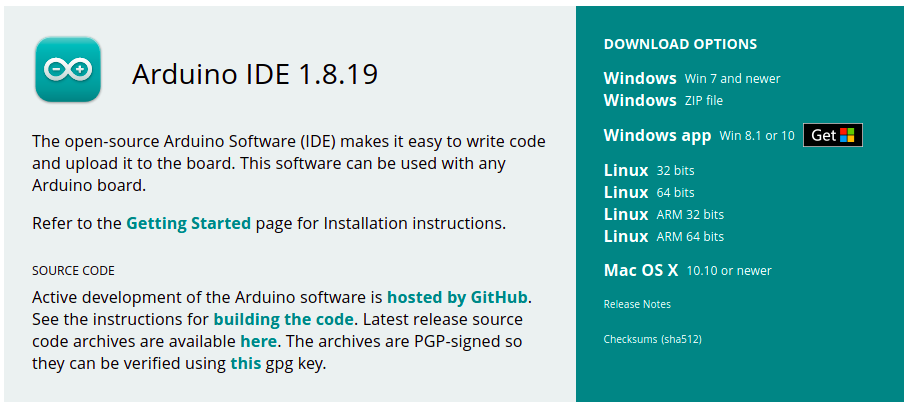

**2 -** As show in the previous image, refer to the **[Getting Started](https://www.arduino.cc/en/Guide)** page to install the software.

**3 -** Open Arduino IDE after the installation is finished:

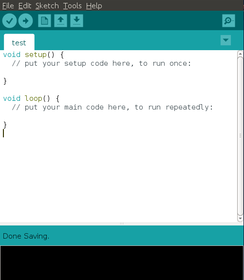

<h1> Add support for the Arduino Nano 33 BLE Sense </h1>

**1 -** In the Arduino IDE, go to **Tools** -> **Board** -> **Boards Manager**:

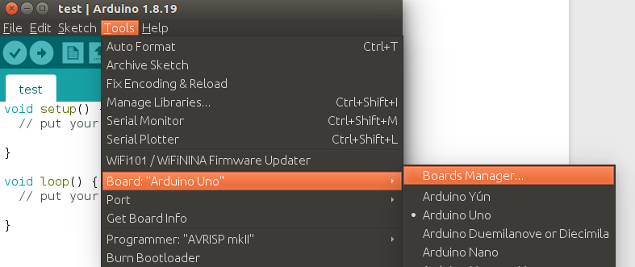

**2 -** In the Boards Manager, search for "Mbed OS Nano" and install **Arduino Mbed OS Nano Boards**:

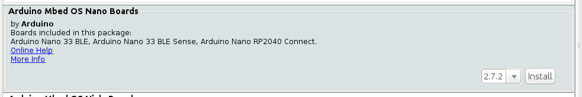

**3 -** Close Arduino IDE after the installation is finished.

**4 -** On Ubuntu, open a new **Terminal** and add a udev rule with the `post_install.sh` script:

```console
chmod +x ~/.arduino15/packages/arduino/hardware/mbed_nano/2.7.2/post_install.sh
sudo ~/.arduino15/packages/arduino/hardware/mbed_nano/2.7.2/post_install.sh
```

**5 -** Open Arduino IDE and connect the Arduino 33 BLE Sense board to the laptop/PC through a micro-USB cable. Go to **Tools** -> **Port** and check whether **Arduino Nano 33 BLE** is displayed:

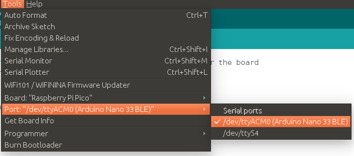

You can now build the sketches for the Arduino Nano 33 BLE Sense.


<h1> Add support for the Raspberry Pi Pico </h1>

**1 -** In the Arduino IDE, go to **Tools** -> **Board** -> **Boards Manager**. Next, search for "RP2040" and install **Arduino Mbed OS RP2040 Boards**:

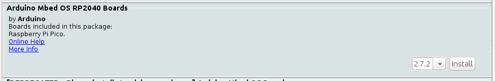

**2 -** Close Arduino IDE after the installation is finished.

**3 -** On Ubuntu, open a new **Terminal** and add a udev rule with the `post_install.sh` script:

```console
chmod +x ~/.arduino15/packages/arduino/hardware/mbed_rp2040/2.7.2/post_install.sh
sudo ~/.arduino15/packages/arduino/hardware/mbed_rp2040/2.7.2/post_install.sh
```

**4 -** Open Arduino IDE and connect the Raspberry Pi Pico board to the laptop/PC through a micro-USB cable. Go to **Tools** -> **Port** and check whether **Raspberry Pi Pico** is displayed:

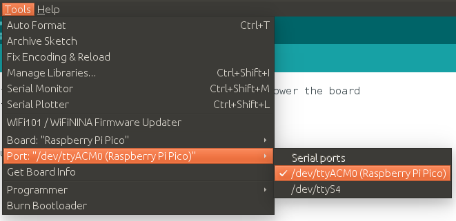

You can now build the sketches for the Raspberry Pi Pico.


<h1> Install the SW libraries required for the book </h1>

Go to **Sketch** -> **Include Library** -> **Manage Libraries**:

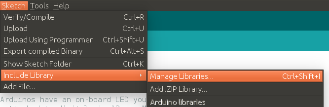

In the **Manage Libraries** window, install the following libraries:

- Arduino_TensorFlowLite
- Arduino_HTS221 (chapter 3)
- Arduino_OV767X (chapter 5)


<h1> How to ... </h1>

<h2> Upload a sketch to the board </h2>

**1 -** Connect the board (either the Arduino Nano 33 BLE Sense or the Raspberry Pi Pico) to the laptop/PC with the micro-USB cable

**2 -** Select the board in **Tools** -> **Board**. For example, select **Raspberry Pi Pico** to upload a sketch to the Raspberry Pi Pico:

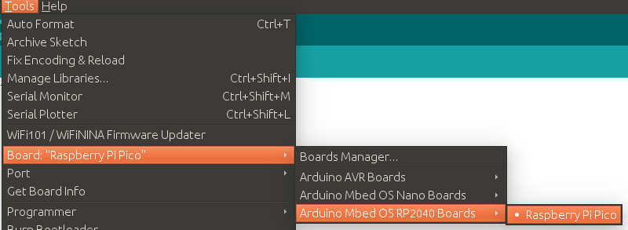

**3 -** Select the correct port for your board in **Tools** -> **Port**:


**4 -** Click on the **upload** button to compile and upload the sketch:

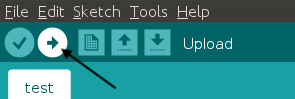


<h2> Import an Arduino library </h2>

Go to **Sketch** -> **Include Library** -> **Add .ZIP Library**:

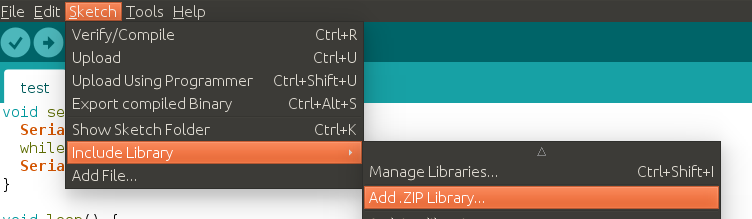


<h2> Use the serial monitor </h2>

Go to **Tools** -> **Serial Monitor**:

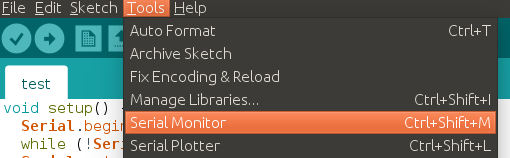


